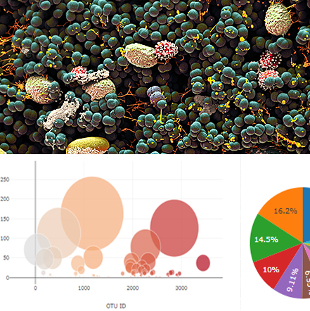

# Belly Button Biodiversity

Build an interactive dashboard to explore the [Belly Button Biodiversity DataSet](http://robdunnlab.com/projects/belly-button-biodiversity/).

* Create a PIE chart to display the top 10 samples.

  * Use `sample_values` as the values for the PIE chart.

  * Use `otu_ids` as the labels for the pie chart.

  * Use `otu_labels` as the hovertext for the chart.

  

* Create a Bubble Chart to display each sample.

  * Use `otu_ids` for the x values.

  * Use `sample_values` for the y values.

  * Use `sample_values` for the marker size.

  * Use `otu_ids` for the marker colors.

  * Use `otu_labels` for the text values.

  

* Display the sample metadata 

  * Display each key/value pair from the metadata JSON object somewhere on the page.

* Update all of the plots any time that a new sample is selected.

Deploy on Heroku.

