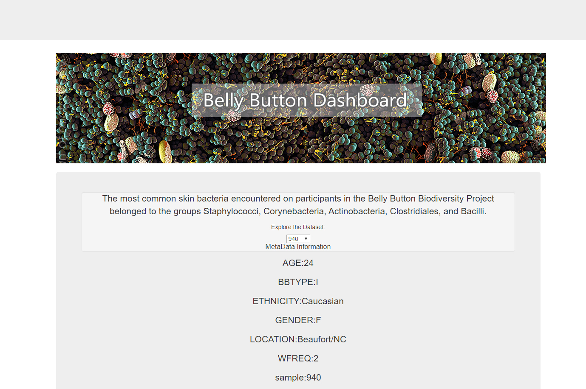
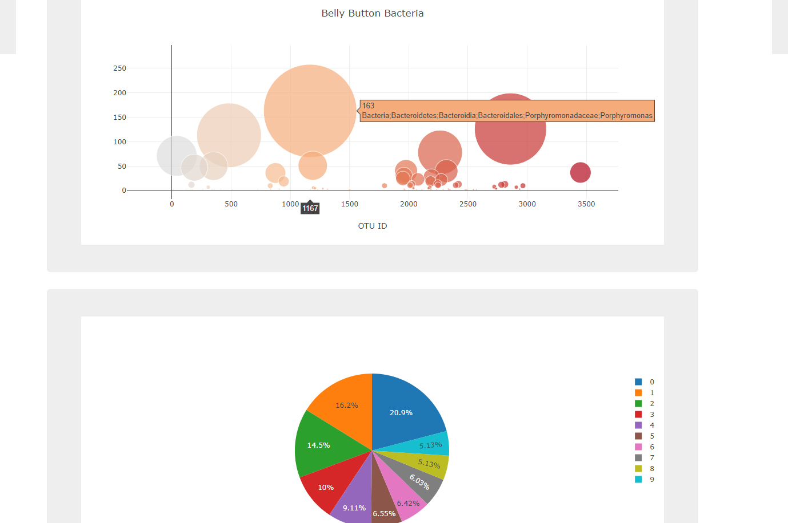

# Belly Button Biodiversity

The purpose of this project is to build a dashboard using data from a study of different bacteria found in people's belly buttons. The data was prepared and sorted on the backend using the Python libraries SQLAlchemy and flask. On the frontend side, plotly.js was used to create all the visualizations in JavaScript. The dashboard has been deployed using Heroku and can be found https://belly-biodiversity-dash.herokuapp.com/.
 
Technologies: 
Python 
JavaScript 
HTML, CSS 
Heroku 
Flask, SQLAlchemy 
Plotly.js 
D3
 
   

  

